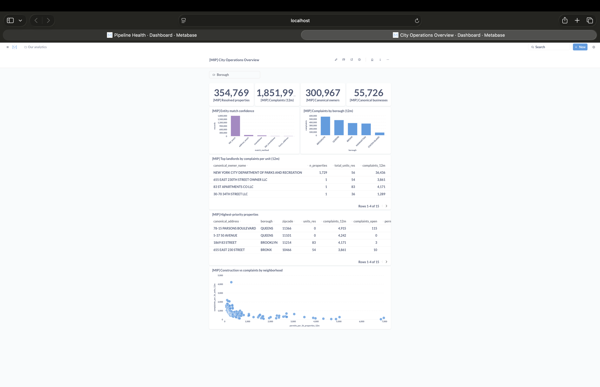
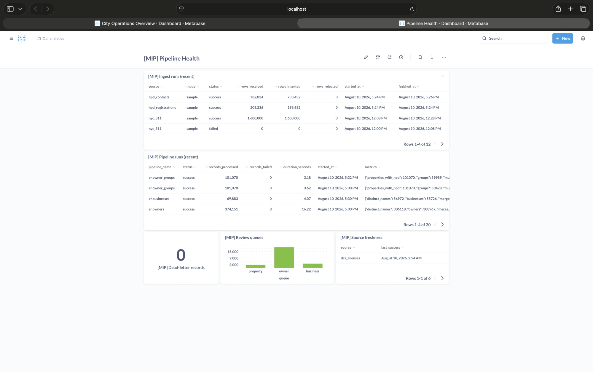

# Multi-Source Municipal Intelligence Platform

A production-style data platform that unifies six disconnected NYC public
datasets — **311 complaints**, **DOB NOW building permits**, **DCWP business
licenses**, **PLUTO tax lots**, and **HPD registrations + contacts** — into
canonical **properties**, **owners**, **businesses**, and **owner
portfolios**, so a city operations team can answer questions no single
dataset can:

> *Which landlords have the highest number of housing complaints per
> residential unit while simultaneously receiving frequent renovation
> permits?*

Python · SQL · dbt · Airflow · DuckDB · Postgres · Metabase · Docker.
Every metric in this README is **measured on this repository's build**
(regenerable via `make evaluate` / `scripts/benchmark.py`) — nothing is
estimated or invented.

## Problem

City departments publish data independently: five borough spellings, two
date regimes inside a single dataset, owner names split across four
fields, 15% duplicated rows, and no universal property or entity ID.
Analysts end up answering questions one silo at a time. This platform
ingests the silos, standardizes them, resolves entities across them —
with explainable evidence for every match — and serves analytics on the
unified model.

## Architecture

```
 NYC Open Data (Socrata SODA 2.1)
 311 · DOB NOW permits · DCWP licenses · PLUTO · HPD registrations/contacts
        │   keyset pagination (:id) · retries+backoff+Retry-After
        │   column projection · schema-change tripwires
        ▼
 raw.*            append-only, versioned by :updated_at (reruns insert 0 rows)
 meta.*           ingest_runs · pipeline_runs · rejected_records (DLQ)
        ▼
 clean.*          Python normalization: usaddress CRF + rule engine
        │         (addresses, names, BBLs, phones; flagged — never dropped)
        ▼
 er.*             entity resolution: bbl_exact → address_exact →
        │         blocked fuzzy → standalone; name clustering;
        │         HPD portfolio grouping; review queues; evidence rows
        ▼
 staging / intermediate / marts        dbt: 17 models, 28 data tests
        ▼
 Postgres (serving) ──> Metabase (2 dashboards, provisioned via API)

 Orchestration: Airflow — nightly, retried, dbt-test-gated publish
```

## Data sources

| Source | Dataset | Why it's here |
|---|---|---|
| 311 Service Requests | `erm2-nwe9` | Complaints with address/BBL/coords |
| DOB NOW Approved Permits | `rbx6-tga4` | Active permit system; owner + applicant names (classic `ipu4-2q9a` rejected after live checks: BIS wind-down left ~15K recent permits vs ~174K here) |
| DCWP Legally Operating Businesses | `w7w3-xahh` | Legal + DBA names, premises addresses |
| PLUTO tax lots | `64uk-42ks` | The property spine: canonical BBL, `unitsres` (no operational dataset has unit counts), owner of record |
| HPD Registrations + Contacts | `tesw-yqqr` / `feu5-w2e2` | Added for the LLC-portfolio change request: corporate owners + officer mailing addresses |

Discovery notes with observed messiness: [docs/data-sources.md](docs/data-sources.md);
generated profiles: [docs/profiling/](docs/profiling/).

## Entity resolution

The datasets *partially* share keys (BBL on 91% of 311 rows, 100% of
permits, 62% of licenses) — so the matcher is deterministic where the
data allows and fuzzy only for the measured remainder:

1. **`bbl_exact`** — valid BBL joins straight onto the PLUTO-seeded
   property spine (91.5% of 478,774 mentions).
2. **`address_exact`** — normalized (borough, address) equality.
   Normalization makes `"123 W. 42nd St Apt 4B"` and
   `"123 WEST 42 STREET #4B"` converge, preserving both property-level
   and unit-level forms.
3. **Blocked fuzzy** — candidates share (borough, house_number); score =
   0.55·street + 0.15·zip + 0.15·geo + 0.15·suffix; ≥0.90 auto,
   0.75–0.90 → review queue, below → standalone. Blocking did **998,330
   comparisons instead of 26.5 billion** naive (99.9962% reduction).
4. **Deterministic standalone IDs** — unmatched mentions become their own
   properties with signature-hashed stable IDs.

Owners/businesses cluster by name with rules earned from measured
failures (subset-scoring bug, sibling-LLC merges — see evaluation), and
**portfolios** group properties via HPD evidence: shared corporate owner
or owner mailing address, registered agents excluded.

Every accepted or queued pair keeps its method + component scores.

## Evaluation (measured, regenerable: `make evaluate`)

**Property matching — BBL-oracle, n = 20,000 real mentions** (matcher
blinded to BBLs it could have used, scored against them):

| metric | value |
|---|---|
| Auto-match precision (strict tax lot) | **98.7%** |
| Recall | 72.5% |
| False positive rate | 0.95% |

Recall is bounded by corner-building frontages (two legitimate addresses
per lot) — measured via a block-cap experiment (cap 200→2000: +0.26pp
recall for 2× comparisons), and largely moot given BBL coverage.

**Name matching — 45 audited labeled pairs** (mostly real pairs from the
match evidence and review queues, conservative labels, committed at
[entity_resolution/eval/labeled_name_pairs.csv](entity_resolution/eval/labeled_name_pairs.csv)):

| scorer | precision | recall | F1 |
|---|---|---|---|
| Final (rules + blend, auto=0.95) | **100%** | **93.3%** | 0.966 |
| token_set_ratio baseline (auto=0.95) | lower on both — kept in report |

The baseline row exists because evaluation *caught it live*:
token_set_ratio scores 1.0 for token subsets and was auto-merging
"ANGEL" with "ANGEL CHU". Full report: [docs/er-evaluation.md](docs/er-evaluation.md).

## Data model

`dim_property` (PLUTO-enriched: units, year built), `dim_owner`,
`dim_business`, `bridge_property_source` (record-level lineage: every
source record → its property, with method + score), incremental
`fct_complaints`, and marts: `mart_property_risk`,
`mart_landlord_performance` (0–100 operational risk score: 40%
complaints/unit, 20% emergency share, 15% open share, 15% trend, 10%
permit churn, percent-ranked in a ≥10-units & ≥3-complaints peer pool —
a **prioritization score, not a wrongdoing claim**),
`mart_business_activity`, `mart_neighborhood_operations`,
`mart_portfolio_performance`.

## Dashboards

Metabase, provisioned via API (`make dashboard`), reading the Postgres
serving layer.

**City Operations Overview** — resolved-entity counts, match-method mix,
complaints by borough, landlord and property prioritization, and
construction vs complaints across 181 ZIPs:



**Pipeline Health** — ingest and pipeline run history, dead-letter count,
ER review-queue sizes, source freshness:



## Example insights (all runnable: [analytics/queries/](analytics/queries/))

- Complaints per building permit by borough (Bronx: 3.65 vs citywide ~2)
- Complaints per residential unit by landlord — the headline question
- Portfolio rollups that reunite per-building LLC families
- Properties with open emergency complaints and fresh permit activity
- Lineage drill-down: any canonical property → its source records →
  match evidence → pipeline runs

## Reliability

- Retries with exponential backoff + jitter, `Retry-After` honored
- Append-only versioned raw layer; reruns verified inserting 0 rows
- Dead-letter table for rejected records (nothing silently dropped)
- Per-source `critical_fields` contract — schema changes fail loudly
- `ERConfig` validates thresholds at load (AUTO ≤ REVIEW is a startup error)
- 28 dbt tests, including ER invariants; test failure gates publishing
- 98 pytest unit/integration tests; pipeline-health Metabase dashboard

## Running locally

```bash
make setup                  # venv + deps + .env
make pipeline               # ingest all 6 sources (bounded samples) → normalize
                            #   → resolve entities → dbt run + test
make evaluate               # regenerate docs/er-evaluation.md
make up                     # postgres + metabase (docker)
make publish                # copy marts DuckDB → Postgres
make dashboard              # provision Metabase dashboards via API
make airflow-up             # optional: nightly DAG in Airflow
make test                   # pytest
```

Sample sizes are configuration: `MIP_MAX_RECORDS` in `.env` plus
per-source windows in `ingestion/sources/*.py`.

## Performance

Measured stage timings and dataset sizes live in
[docs/benchmarks.md](docs/benchmarks.md) (generated by
`scripts/benchmark.py`; only sizes actually run are reported).

## Engineering tradeoffs

Condensed here, argued in full in [docs/architecture.md](docs/architecture.md):
DuckDB (embedded, fast, single-writer — documented in the DAG) vs
Postgres (serving layer only); batch over streaming (decision cadence is
nightly); deterministic-first ER because the data has partial keys;
precision over recall in auto-merges (false merges are unrecoverable,
false splits sit in a review queue); rules over ML at bootstrap (no
honest labels; auditability), with the eval harness as the on-ramp to a
learned matcher.

## What I would build next

Human review UI for the match queues (accept/reject feeding the labeled
set) · geo-grid second blocking pass for corner-lot recall · learned ER
model gated by the existing eval harness · multi-year 311 backfill ·
cloud deployment (RDS + K8s Airflow + SSO Metabase) · role-based access.

## Repo map

```
ingestion/          Socrata client, source configs, versioned raw loader
normalization/      raw JSON → typed clean.* (uses entity_resolution normalizers)
entity_resolution/  normalizers, blocking, matcher, portfolio, evaluator, eval CSV
dbt/                staging → intermediate → marts (+tests, custom generics)
analytics/queries/  the 9 cross-dataset SQL questions
airflow/dags/       nightly production-style DAG
scripts/            ingest / normalize / resolve / evaluate / benchmark /
                    publish_postgres / provision_metabase / profile_dataset
customer_requests/  FDE scenario: requirements → build → change request → iteration
docs/               architecture · interview guide · evaluation · profiles · benchmarks
```
